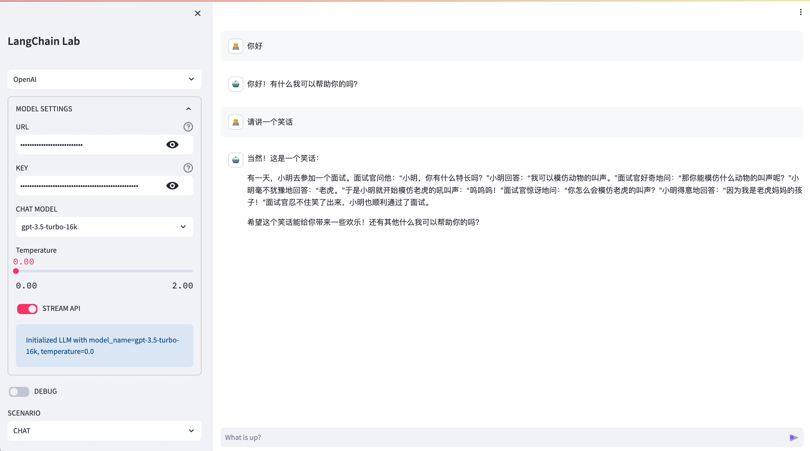
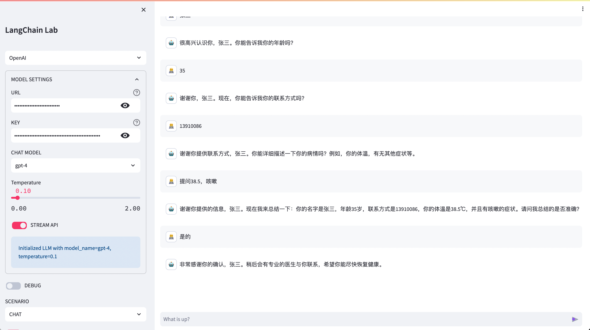
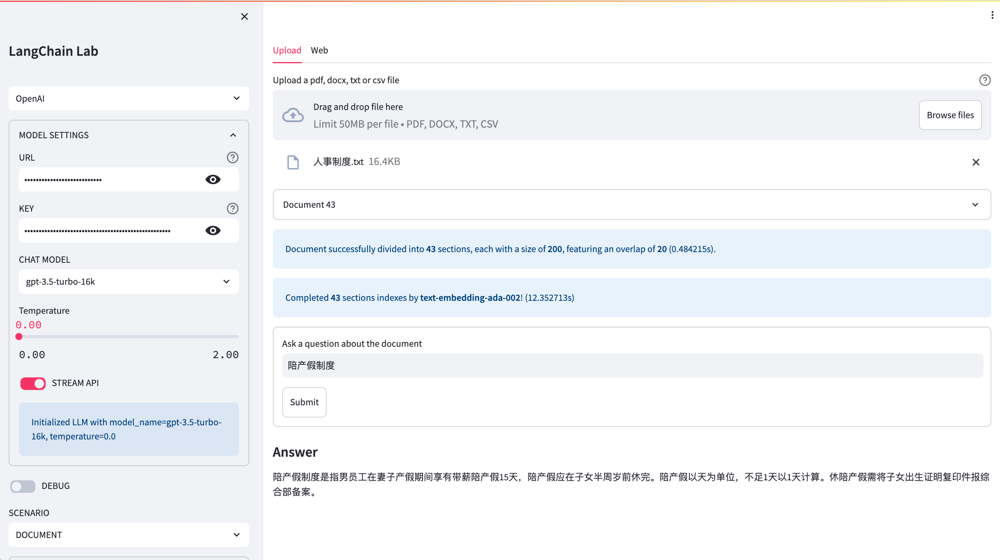

# LangChain LAB | [中文](README_ZH.md)

This experiment will verify different use cases of LLM using LangChain, which include chat, role-playing, and document-based QA.

## Prerequisites

* python 3.10+
* make

## Quick Guide

Create a `.env` file in the project's root directory and input OpenAI's API Key and Model Name list in the file.

```text
OPENAI_API_KEY=sk-xxx
OPENAI_API_MODEL_NAMES=gpt-3.5-turbo-16k,gpt-4
```

Install the dependencies.

```shell
make install
```

Run the project.

```shell
make run
```

## Screenshot





## Environmental Variables

You can configure additional parameters either through environment variables or the `.env` file.

**`DEFAULT_AI_PLATFORM` / `DEFAULT_AI_PLATFORM_SUPPORT`**

To set the supported platform, use the `DEFAULT_AI_PLATFORM_SUPPORT` variable. The default value is `OpenAI.` If you want to enable calls to the FastChat platform, you can set it to `FastChat, OpenAI`. To specify the default platform name from the list, use the `DEFAULT_AI_PLATFORM` parameter. The default value is `OpenAI.`

**`OPENAI_API_BASE` / `OPENAI_API_KEY` / `OPENAI_API_MODEL_NAMES`**

To set the API KEY, use the `OPENAI_API_KEY` variable. Specify the call address by setting the `OPENAI_API_BASE` variable. If desired, you can set optional model names by separating them with commas in the `OPENAI_API_MODEL_NAMES` variable. The default options are `gpt-3.5-turbo-16k,gpt-4`. Alternatively, you can choose not to set these parameters initially and configure them on the page later.

**`FASTCHAT_API_BASE` / `FASTCHAT_API_KEY` / `FASTCHAT_API_MODEL_NAMES`**

If you have enabled support for the FastChat platform using `DEFAULT_AI_PLATFORM_SUPPORT`, you can set the API KEY using `FASTCHAT_API_KEY`. Specify the call address by setting `FASTCHAT_API_BASE`. Similarly, you can set optional model names using `FASTCHAT_API_MODEL_NAMES`. Just like the OpenAI parameters, you have the option to configure these parameters on the page later. However, please note that the `FASTCHAT_API_MODEL_NAMES` parameter must provide an optional model name.

**`HUGGINGFACE_CATCH_PATH`**

To set the hugging face cache directory, use `HUGGINGFACE_CATCH_PATH`. The default value is `./huggingface`. When using a non-OpenAI API, you can utilize the EMBED huggingface models. After the initial selection, these models will be downloaded to the cache directory. The currently available models are as follows:

* moka-ai/m3e-base
* sentence-transformers/msmarco-distilbert-base-v4
* shibing624/text2vec-base-chinese
