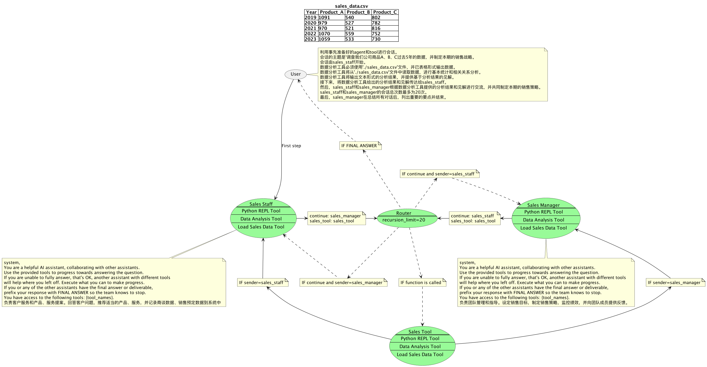

# 市场部销售智能助手（POC）

> gpt-4-turbo

## 多代理协商过程

### 销售员

{'function_call': {'arguments': '{}', 'name': 'load_sales_data_tool'}}
首先，我们需要加载并查看销售数据，以便进行详细分析。我将使用提供的工具来加载数据。

### 数据分析工具

load_sales_data_tool response: Sales Data: 

|    |   Year |   Product_A |   Product_B |   Product_C |
|---:|-------:|------------:|------------:|------------:|
|  0 |   2019 |        1091 |         540 |         802 |
|  1 |   2020 |         979 |         527 |         782 |
|  2 |   2021 |         970 |         521 |         816 |
|  3 |   2022 |        1070 |         559 |         752 |
|  4 |   2023 |        1059 |         533 |         730 |

### 销售员

{'function_call': {'arguments': '{}', 'name': 'data_analysis_tool'}}
我们已经成功加载了过去五年商品A、B、C的销售数据。接下来，我将使用数据分析工具来分析这些数据，以便我们可以更好地理解销唀趋势和产品间的关系，并据此制定本期销售策略。让我执行数据分析。

### 数据分析工具

data_analysis_tool response: Basic statistics:

|       |       Year |   Product_A |   Product_B |   Product_C |
|:------|-----------:|------------:|------------:|------------:|
| count |    5       |      5      |      5      |      5      |
| mean  | 2021       |   1033.8    |    536      |    776.4    |
| std   |    1.58114 |     55.4319 |     14.6629 |     35.3667 |
| min   | 2019       |    970      |    521      |    730      |
| 25%   | 2020       |    979      |    527      |    752      |
| 50%   | 2021       |   1059      |    533      |    782      |
| 75%   | 2022       |   1070      |    540      |    802      |
| max   | 2023       |   1091      |    559      |    816      |

Correlation matrix:

|           |       Year |   Product_A |   Product_B |   Product_C |
|:----------|-----------:|------------:|------------:|------------:|
| Year      |  1         |   0.0770147 |    0.194099 |   -0.777903 |
| Product_A |  0.0770147 |   1         |    0.749269 |   -0.43633  |
| Product_B |  0.194099  |   0.749269  |    1        |   -0.464733 |
| Product_C | -0.777903  |  -0.43633   |   -0.464733 |    1        |

### 销售员

根据数据分析工具的结果，我们可以看到以下基本统计和相关性分析：

### 基本统计数据：
- **Product_A** 的平均销量为 1033.8，标准差为 55.43。
- **Product_B** 的平均销量为 536，标准差为 14.66。
- **Product_C** 的平均销量为 776.4，标准差为 35.37。

### 相关性分析：
- **Product_A** 与 **Product_B** 有较高的正相关性（0.749），表明它们的销量通常同向变动。
- **Product_A** 与 **Product_C** 有中等程度的负相关性（-0.436），表明它们的销量通常反向变动。
- **Product_B** 与 **Product_C** 也有中等程度的负相关性（-0.465）。
- **Year** 与 **Product_C** 有较强的负相关性（-0.778），暗示随着时间的推移，Product_C的销量趋势下降。

根据这些结果，我们可以开始与销售经理讨论如何利用这些见解来制定本期的销售策略。

### 销售经理

很好，根据这些数据分析结果，我们可以看出几个关键点来帮助制定销售策略：

1. **Product_A** 和 **Product_B** 的销量表现稳定，且两者有很高的正相关性，说明我们可以考虑捆绑销售或者共同推广这两个产品。
2. **Product_C** 随着时间的推移销量有下降趋势，我们需要特别关注这个产品，可能需要调整产品定位或增加营销力度。
3. 由于 **Product_A** 和 **Product_C**、**Product_B** 和 **Product_C** 呈现负相关性，这可能表明市场对这些产品的需求分布不均。针对不同目标客户群的精准营销可能会有效。

接下来，我们应该讨论具体的策略和行动方案。你认为应该采取哪些具体措施？

### 销售员

根据分析结果和您的建议，我认为可以采取以下几个具体措施来制定销售策略：

1. **捆绑销售策略**：
   - 对于 **Product_A** 和 **Product_B**，我们可以设计一些捆绑促销活动，比如购买Product_A时可以享受Product_B的特别折扣。这样不仅可以增加单个顾客的购买量，还可以利用两者的正相关性来提升总销量。

2. **重点推广Product_C**：
   - 针对 **Product_C** 的销量下降问题，我们可以考虑重新设计其营销活动，比如增加广告投放、推出新的促销策略或者优化产品特性以吸引更多顾客。
   - 可以通过市场调研来了解消费者对Product_C下降的具体原因，以便更精确地调整产品或营销策略。

3. **精准营销**：
   - 利用数据分析结果中的相关性，对目标客户进行细分。例如，针对可能对Product_A和Product_B感兴趣的客户群体进行专门的营销活动，同时为可能对Product_C感兴趣的另一群体制定不同的策略。
   - 进行在线和离线的市场活动，使用社交媒体、电子邮件营销等多渠道推广，以覆盖更广泛的潜在顾客。

4. **优化库存和供应链管理**：
   - 根据销售数据和趋势预测，优化库存管理，确保高需求产品的供应充足，同时避免过多库存积压。

这些措施可以帮助我们更有效地针对不同产品的市场表现制定策略，同时增强我们的市场竞争力。接下来我们可以进一步讨论和细化这些策略的实施细节。

### 销售经理

非常好的提议，接下来我们可以按照这几个策略的方向来进一步细化和实施：

1. **捆绑销售策略的具体实施**：
    - 设定捆绑销售的时间框架和目标销售额。
    - 选择合适的销售渠道和推广方式，例如线上平台或线下门店特卖活动。
    - 确定捆绑产品的折扣力度和促销期限，以吸引顾客购买。
  
2. **针对Product_C的推广策略细化**：
    - 确定新营销活动的预算和主题，如“重塑经典”或“秋季新品推介”。
    - 选择适合Product_C特性的广告媒介，如视频广告、社交媒体或户外广告。
    - 设计与顾客互动的活动，如用户体验会、评测赠品等，以增加产品曝光和吸引力。

3. **精准营销的执行细节**：
    - 使用CRM工具或市场调研数据来细分客户群体，确定具体的目标市场。
    - 针对不同客户群体设计个性化的营销信息和促销活动。
    - 跟踪营销活动的效果，根据反馈调整策略和营销手段。

4. **库存和供应链管理优化**：
    - 分析销售数据，预测不同产品的需求量，合理调配资源。
    - 与供应商协调，确保在促销期间产品供应的稳定性。
    - 定期检查库存状态，减少过剩或短缺的风险。

我们可以从这些细化措施着手，逐步推动每项策略的实施，并定期评估其效果，以确保我们的销售目标得以实现。如果您有其他建议或需要进一步讨论的点，请随时提出。

### 销售员

目前的策略细化已经非常全面，我认为可以进一步加强以下几个方面：

1. **数据驱动的决策制定**：
   - 继续利用销售数据进行深入分析，监控策略实施过程中的销售数据变化，及时调整策略。
   - 引入更多维度的数据分析，如顾客满意度调查、市场竞争分析等，为决策提供更全面的支持。

2. **增强客户关系管理**：
   - 通过定期的客户反馈和满意度调查，了解客户对产品和服务的实际感受，从而更好地调整产品和服务。
   - 建立忠诚度计划，提升回头客比例，通过客户推荐获取新客户。

3. **持续的市场监测和预警系统**：
   - 建立市场动态监测系统，实时掌握行业趋势和竞争对手动态，以便快速响应市场变化。
   - 设立预警机制，当销售数据或市场反馈出现异常时，能够迅速采取应对措施。

如果这些补充措施得到认可，我们可以开始制定具体的执行计划和时间表，确保每项策略都能有效执行并达到预期的销售目标。

### 销售经理

非常好的补充，这些措施将进一步加强我们的销售策略，确保我们对市场变化保持敏感和响应迅速。我们将按照以下步骤推进：

1. **执行计划和时间表的制定**：
   - 对每项策略制定详绑的执行计划，包括关键的执行步骤、责任人、所需资源和预期完成时间。
   - 制定时间表，安排定期的审查会议，确保各项策略按计划推进。

2. **资源和预算的分配**：
   - 根据策略需求和预期投入产出比，合理分配预算和人力资源。
   - 确保各部门协调合作，资源利用最大化。

3. **监控和评估机制的建立**：
   - 设立定期评估机制，通过销售数据、客户反馈等多种渠道评估策略的效果。
   - 对策略进行必要的调整和优化，确保达到最佳效果。

4. **内部沟通和培训**：
   - 增强内部沟通，确保所有团队成员了解策略目标和执行细节。
   - 定期举行培训和工作坊，提升团队的专业技能和执行效率。

5. **外部合作和市场扩展**：
   - 探索与外部合作伙伴的合作机会，如共同营销活动、技术合作等。
   - 开拓新市场和新客户群，增加销售渠道和触点。

这些步骤将帮助我们系统地实施和监控销售策略，确保我们能够有效地达到销售目标。我们将持续跟进每项措施的进展，并在必要时进行调整。如果没有其他补充，我们可以开始执行这些计划。

### 销售员

非常好，我们已经明确了详细的行动方案和步骤，我将开始准备必要的文档和资源，以确保策略的顺利执行。我们将按照既定的时间表推进每项工作，并保持定期的沟通和反馈机制，确保每一步都能按计划进行。

请随时更新相关进展和任何需要协调的问题，我将确保资源的合理分配和调整。我们的团队也将保持全力支持，以实现这些销售目标。

感谢您的指导和支持，让我们共同努力，确保本期销售策略的成功实施。如果有任何新的信息或变更，请及时通知我。让我们开始这一激动人心的旅程吧！
FINAL ANSWER:
非常好，我们已经明确了详细的行动方案和步骤，我将开始准备必要的文档和资源，以确保策略的顺利执行。我们将按照既定的时间表推进每项工作，并保持定期的沟通和反馈机制，确保每一步都能按计划进行。

请随时更新相关进展和任何需要协调的问题，我将确保资源的合理分配和调整。我们的团队也将保持全力支持，以实现这些销售目标。

感谢您的指导和支持，让我们共同努力，确保本期销售策略的成功实施。如果有任何新的信息或变更，请及时通知我。让我们开始这一激动人心的旅程吧！

