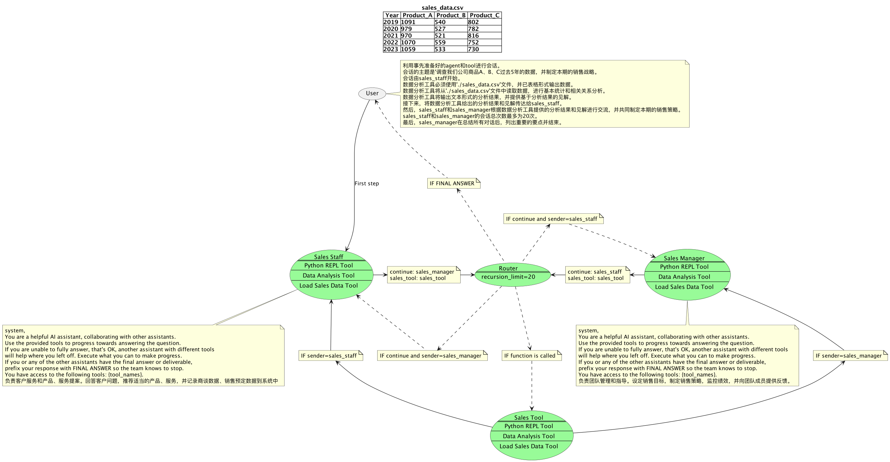

# 市场部销售智能助手（POC）

> gpt-3.5-turbo

## 多代理协商过程

### 销售员

{'function_call': {'arguments': '{}', 'name': 'load_sales_data_tool'}}

### 数据分析工具

load_sales_data_tool response: Sales Data:

|    |   Year |   Product_A |   Product_B |   Product_C |
|---:|-------:|------------:|------------:|------------:|
|  0 |   2019 |        1091 |         540 |         802 |
|  1 |   2020 |         979 |         527 |         782 |
|  2 |   2021 |         970 |         521 |         816 |
|  3 |   2022 |        1070 |         559 |         752 |
|  4 |   2023 |        1059 |         533 |         730 |

### 销售员

{'function_call': {'arguments': '{}', 'name': 'data_analysis_tool'}}

### 数据分析工具

data_analysis_tool response: Basic statistics:

|       |       Year |   Product_A |   Product_B |   Product_C |
|:------|-----------:|------------:|------------:|------------:|
| count |    5       |      5      |      5      |      5      |
| mean  | 2021       |   1033.8    |    536      |    776.4    |
| std   |    1.58114 |     55.4319 |     14.6629 |     35.3667 |
| min   | 2019       |    970      |    521      |    730      |
| 25%   | 2020       |    979      |    527      |    752      |
| 50%   | 2021       |   1059      |    533      |    782      |
| 75%   | 2022       |   1070      |    540      |    802      |
| max   | 2023       |   1091      |    559      |    816      |

Correlation matrix:

|           |       Year |   Product_A |   Product_B |   Product_C |
|:----------|-----------:|------------:|------------:|------------:|
| Year      |  1         |   0.0770147 |    0.194099 |   -0.777903 |
| Product_A |  0.0770147 |   1         |    0.749269 |   -0.43633  |
| Product_B |  0.194099  |   0.749269  |    1        |   -0.464733 |
| Product_C | -0.777903  |  -0.43633   |   -0.464733 |    1        |

### 销售员

根据数据分析工具提供的分析结果，我们可以看到以下关键信息：

- 产品A的平均销量为1033.8，产品B的平均销量为536，产品C的平均销量为776.4。
- 产品A和产品B之间有较强的正相关关系（相关系数为0.749269），产品C与产品A和产品B之间的相关性较弱。
- 年份与产品C之间呈现出较强的负相关关系（相关系数为-0.777903）。

基于以上分析结果，我们建议采取以下销售策略：

1. 提高产品C的销量：由于产品C与年份之间呈现负相关关系，可以尝试通过促销活动或市场推广来提高产品C的销量。

2. 产品A和产品B的搭配销售：由于产品A和产品B之间有较强的正相关关系，可以考虑将产品A和产品B进行搭配销售，以提高整体销量。

sales_staff，您认为如何？您可以考虑以上建议并提出自己的想法。

### 销售经理

sales_staff已经提供了基于数据分析工具的分析结果的见解，并提出了相应的销售策略建议。销售staff现在有机会回应提出的建议，并提供自己的想法。销售staff，您对以上销售策略有什么想法或建议吗？您认为还有哪些方面可以优化或改进？

### 销售员

销售staff，请提供您对销售策略的想法和建议。您可以考虑上述建议的实施可行性，以及可能的优化或改进方面。感谢您的反馈！

### 销售经理

销售staff提出的销售策略建议是基于数据分析结果的合理推断。在考虑实施这些策略时，可以进一步思考以下方面进行优化或改进：

1. **市场调研与竞争分析**：在制定促销活动或市场推广策略时，可以进行更深入的市场调研，了解客户需求和竞争对手的情况，以制定更为针对性的销售策略。

2. **销售团队培训**：考虑对销售团队进行培训，提升他们的销售技巧和产品知识，以更好地推动销售业绩的提升。

3. **数据监控与反馈**：建立有效的销售数据监控系统，及时跟踪销售情况并反馈给销售团队，以便他们及时调整销售策略。

4. **客户关系管理**：加强客户关系管理，提升客户满意度和忠诚度，从而增加回购率和推荐率。

销售staff，您对以上优化建议有何看法？您是否认同这些方面的重要性，或者您有其他想法和建议？请分享您的想法，以便我们共同制定更具实施效果的销售策略。感谢您的反馈！

### 销售员

根据销售经理提出的优化建议，我认同以下方面的重要性：

1. **市场调研与竞争分析**：深入了解市场和竞争对手的情况非常重要，可以帮助我们更好地定位产品和制定有效的促销策略。

2. **销售团队培训**：提升销售团队的专业知识和技能对于提高销售业绩至关重要，可以增强销售团队的竞争力。

3. **数据监控与反馈**：建立有效的数据监控系统可以帮助我们及时了解销售情况，及时调整销售策略以适应市场变化。

4. **客户关系管理**：加强客户关系管理有助于提升客户满意度和忠诚度，从而提高回购率和口碑传播效果。

我认为这些优化建议非常实用和重要，可以进一步完善销售策略并提升销售绩效。我们可以结合以上建议，制定更全面和有效的销售战略，以实现更好的销售业绩和客户满意度。感谢销售经理提供的指导和建议，我会认真考虑并积极落实。

### 销售经理

FINAL ANSWER

销售staff已对销售经理提出的优化建议做出了积极回应，并表达了认同和愿意落实的态度。结合市场调研、销售团队培训、数据监控与反馈以及客户关系管理等方面的建议，销售团队将进一步完善销售策略，提高销售绩效和客户满意度。销售团队将密切合作，共同制定并执行更具实施效果的销售战略。

